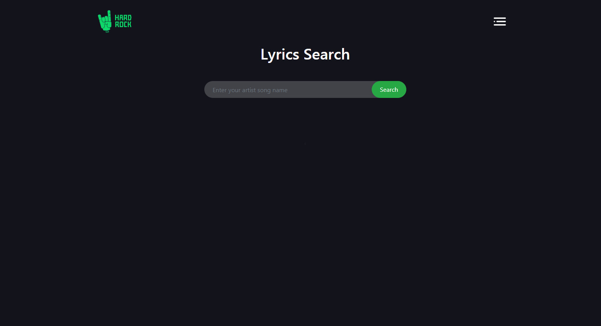
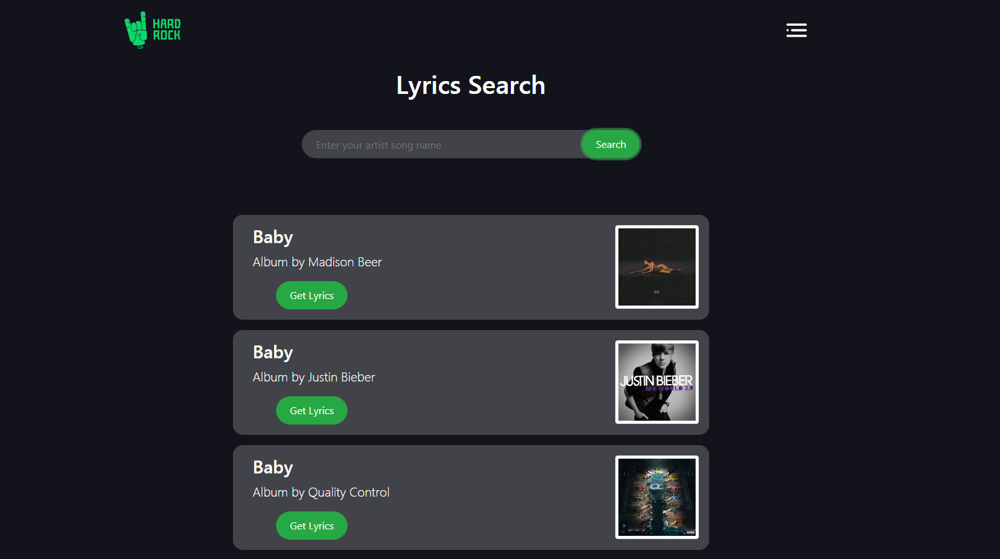
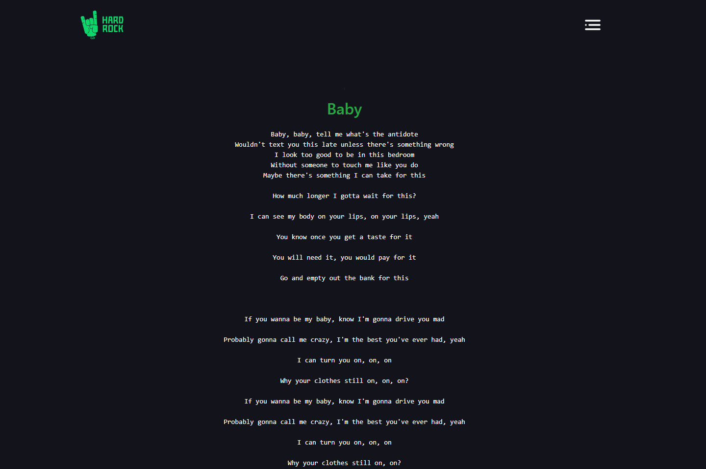

# Resume Drive Link : https://drive.google.com/file/d/1tTgnJOqapxgjETIjJMTAT3s0RixQS0tl/view?usp=sharing
# Live Website Link : https://freelancerifaz.github.io/hard-rock-api-assignment/

# Home Page

# After Search a Song

# Song Lyric

# Project Details

<ul>
  <li>This project is mainly focused rest api . This project is show to how to implement others website information show my website with using fetch.</li>
  <li>Can search a song , show song and singer name and a button which is execute to show the song lyrics</li>
</ul>
